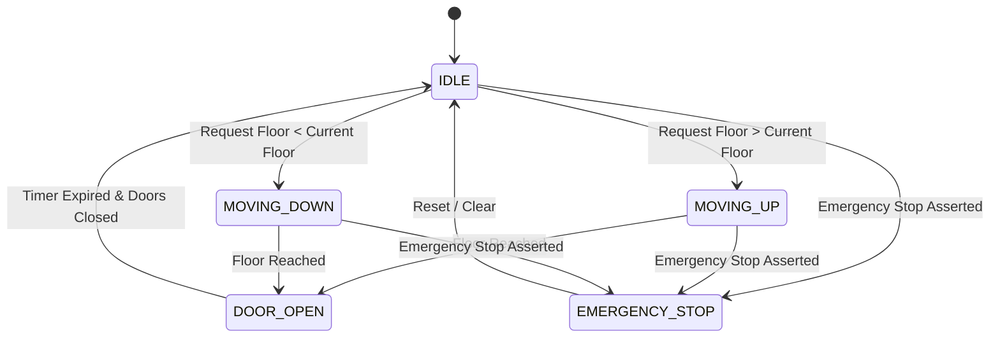

# VHDL Digital Systems & FPGA Logic Design Library

[](https://github.com/HarryRogers073/vhdl-digital-systems)
[](https://www.intel.com/content/www/us/en/software/programmable/quartus-prime/overview.html)
[-success?style=for-the-badge)](https://www.harry-rogers.com)
[](LICENSE)

> A modular digital logic and FPGA hardware description library written in **IEEE standard VHDL**. Developed for the **Digital Systems Design** curriculum at the **University of Brighton** (Grade: **84% Distinction / A+**). Implements synchronous finite state machines (FSMs), priority request queues, arithmetic sub-units (adders, multipliers, comparators), sequential shift registers, and seven-segment hexadecimal display decoders verified in **Intel Quartus Prime** and **ModelSim**.

---

### 📜 Academic Integrity & Attribution Disclosure
- **Author & RTL Design:** Authored and verified by **Harry Rogers** for Digital Systems Design coursework at the University of Brighton, achieving an **84% Distinction Grade (A+)**.
- **Standards & EDA Environments:** RTL architectures conform to IEEE 1076-1993 standard VHDL packages (`ieee.std_logic_1164.all`, `ieee.numeric_std.all`). Compilation, logic synthesis, and timing simulations were performed using **Intel Quartus Prime** and **ModelSim-Intel FPGA Starter Edition**.
- **Hardware Targets:** Pin assignments, I/O standards, and 50 MHz clock oscillator constraints reference Altera/Intel Cyclone II / DE2 development board specifications.

---

## 🎯 Flagship Design: Multi-Floor Elevator Controller FSM (`elevator_fsm/`)

The primary component is a multi-floor elevator control system featuring an intelligent request arbitration queue, safety interlocks, and door timing state machines:

- **`Lift.vhd` & `Lift_tb.vhd`:** Main elevator controller Finite State Machine (FSM) coordinating floor tracking (`IDLE`, `MOVING_UP`, `MOVING_DOWN`, `DOOR_OPEN`, `EMERGENCY_STOP`).
- **`Queue.vhd`:** Synchronous request register queue latching button press events and dispatching optimal floor servicing sequences.
- **`doors_but_better.vhd`:** Door actuation timing module with safety sensor interlocks preventing motion during boarding.



---

## 🧩 Arithmetic & Sequential Building Blocks

### 1. Arithmetic Units (`arithmetic_units/`)
- **`Adder_Sub.vhd`:** Selectable ripple-carry adder/subtractor with 2's complement logic and overflow detection.
- **`full_adder_vhdl_code.vhd`:** Structural 1-bit full adder primitive.
- **`bitMultip.vhd`:** 2-bit combinational binary multiplier.
- **`Comp4.vhd`:** 4-bit unsigned magnitude comparator ($A > B$, $A = B$, $A < B$).
- **`Sub4.vhd`:** 4-bit dedicated binary subtractor.

### 2. Sequential Logic & Timing (`sequential_logic/`)
- **`ShiftReg1.vhd`:** Multi-mode parallel-in serial-out (PISO) / serial-in parallel-out (SIPO) shift register with behavioral testbench (`test_bench.vhd`).
- **`Counter.vhd` & `CounterTB.vhd`:** Modulo-$N$ synchronous up/down counter with asynchronous reset and terminal count flag.
- **`clock_div1.vhd`:** Integer clock prescaler divider converting high-frequency board oscillators (e.g. 50 MHz) to 1 Hz visual blinking and display scan frequencies.

### 3. Display Drivers (`display_drivers/`)
- **`bin2hex.vhd`:** Combinational 4-bit binary to 7-segment active-low common-anode LED decoder.

---

## 📂 Repository Layout

```
vhdl-digital-systems/
├── elevator_fsm/                   # Flagship Elevator FSM & Testbenches
│   ├── Lift.vhd                    # Core FSM controller
│   ├── Lift_tb.vhd                 # Comprehensive testbench
│   ├── Queue.vhd                   # Button event request queue
│   └── doors_but_better.vhd        # Door timing & interlock module
├── arithmetic_units/               # Combinational and arithmetic RTL
│   ├── Adder_Sub.vhd               # Adder/subtractor core
│   ├── bitMultip.vhd               # Binary multiplier
│   ├── Comp4.vhd                   # 4-bit magnitude comparator
│   └── full_adder_vhdl_code.vhd    # Structural 1-bit full adder
├── sequential_logic/               # Clock dividers and registers
│   ├── Counter.vhd                 # Synchronous counter
│   ├── CounterTB.vhd               # Counter simulation harness
│   ├── ShiftReg1.vhd               # Configurable shift register
│   └── clock_div1.vhd              # Frequency prescaler
└── display_drivers/                # Human-machine interface
    └── bin2hex.vhd                 # 7-segment hex display decoder
```

---

## 🛠️ Simulation & Synthesis Instructions

### Compiling in Intel Quartus Prime
1. Open **Intel Quartus Prime** (Lite or Standard Edition).
2. Create a new project targeting your FPGA device (e.g. Intel Cyclone IV / Cyclone V or DE2 development board).
3. Add the required `.vhd` files into the project files hierarchy.
4. Run **Analysis & Synthesis** (`Ctrl + K`).

### Simulating in ModelSim
1. Open **ModelSim-Intel FPGA Starter Edition**.
2. Compile the design files and corresponding testbenches (`Lift_tb.vhd` or `CounterTB.vhd`).
3. Load the testbench work module and run simulation:
   ```tcl
   run 5000 ns
   ```
4. Observe the state transitions and waveform traces in the Wave window.

---

## 🎓 Academic Attribution

- **Author:** Harry Rogers
- **Degree:** BEng (Hons) Electronic & Computer Engineering (First-Class Honours)
- **Institution:** University of Brighton
- **Curriculum:** Digital Systems Design (Grade: 84% / A+)
- **Portfolio:** [www.harry-rogers.com](https://www.harry-rogers.com)
- **LinkedIn:** [linkedin.com/in/harryrogers073](https://www.linkedin.com/in/harryrogers073/)

---

## 📄 License
This repository is licensed under the MIT License - see [LICENSE](LICENSE) for details.
