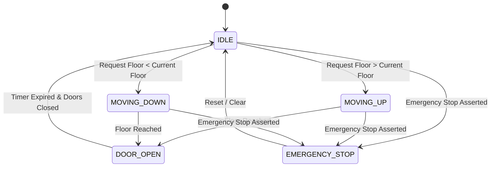

# VHDL Digital Systems & FPGA Logic Design Library

[](https://github.com/HarryRogers073/vhdl-digital-systems)
[](https://www.intel.com/content/www/us/en/software/programmable/quartus-prime/overview.html)
[-success?style=for-the-badge)](https://www.harry-rogers.com)
[](LICENSE)

> A modular digital logic and FPGA hardware description library written in **IEEE standard VHDL** for the **Digital Systems Design** module at the **University of Brighton** (Grade: **84% Distinction / A+**). It includes a synchronous multi-floor elevator controller state machine with request queuing, arithmetic circuits (multipliers, comparators, adders, subtractors), sequential logic, and seven-segment hexadecimal display decoders verified in **Intel Quartus Prime** and **ModelSim**.

---

### Academic Attribution & Provenance

| Module / File | Description | Author / Provenance |
| :--- | :--- | :--- |
| **`elevator_fsm/Lift.vhd`** | Core elevator Finite State Machine controller | **Harry Rogers** (Original Design) |
| **`elevator_fsm/Lift_tb.vhd`** | Comprehensive behavioral testbench for elevator FSM | **Harry Rogers** (Original Design) |
| **`elevator_fsm/Queue.vhd`** | Synchronous button event request register queue | **Harry Rogers** (Original Design) |
| **`elevator_fsm/doors_but_better.vhd`** | Timed door actuation controller with safety pause | **Harry Rogers** (Original Design) |
| **`display_drivers/bin2hex.vhd`** | 4-bit binary to 7-segment hex display decoder | **Harry Rogers** (Original Design) |
| **`arithmetic_units/bitMultip.vhd`** | 2-bit combinational binary multiplier array | **Harry Rogers** (Original Design) |
| **`arithmetic_units/Comp4.vhd`** | 4-bit unsigned magnitude comparator | **Harry Rogers** (Original Design) |
| **`arithmetic_units/Sub4.vhd`** | 4-bit dedicated binary subtractor | **Harry Rogers** (Original Design) |
| **`arithmetic_units/full_adder_vhdl_code.vhd`** | Structural 1-bit full adder primitive | **Harry Rogers** (Original Design) |
| **`sequential_logic/clock_div1.vhd`** | Integer clock prescaler divider (50 MHz to 1 Hz) | **Harry Rogers** (Original Design) |
| **`sequential_logic/CounterTB.vhd`** | Behavioral testbench for binary counter | **Harry Rogers** (Original Design) |
| **`sequential_logic/test_bench.vhd`** | Behavioral testbench for shift register | **Harry Rogers** (Original Design) |
| **`arithmetic_units/Adder_Sub.vhd`** | Ripple-carry adder/subtractor | **Chris Knight** (University Lab Reference) |
| **`sequential_logic/Counter.vhd`** | 2-bit synchronous binary up-counter | **Chris Knight** (University Lab Reference) |
| **`sequential_logic/ShiftReg1.vhd`** | 4-bit parallel-in serial-out shift register | **Chris Knight** (University Lab Reference) |

---

## Flagship Design: Multi-Floor Elevator Controller FSM (`elevator_fsm/`)

The primary system is a multi-floor elevator controller with request arbitration and door safety timing:

- **`Lift.vhd` & `Lift_tb.vhd`:** Coordinates elevator states (`IDLE`, `MOVING_UP`, `MOVING_DOWN`, `DOOR_OPEN`, `EMERGENCY_STOP`).
- **`Queue.vhd`:** Latches floor call button presses and tracks pending requests.
- **`doors_but_better.vhd`:** Manages door open/close cycle timers with obstacle interlocks.



---

## Repository Structure

```text
vhdl-digital-systems/
├── elevator_fsm/                   # Multi-Floor Elevator Controller
│   ├── Lift.vhd                    # Main controller FSM (Harry Rogers)
│   ├── Lift_tb.vhd                 # Simulation testbench (Harry Rogers)
│   ├── Queue.vhd                   # Floor request register queue (Harry Rogers)
│   └── doors_but_better.vhd        # Door timing & interlock module (Harry Rogers)
├── arithmetic_units/               # Combinational and arithmetic RTL
│   ├── bitMultip.vhd               # Binary multiplier (Harry Rogers)
│   ├── Comp4.vhd                   # 4-bit magnitude comparator (Harry Rogers)
│   ├── full_adder_vhdl_code.vhd    # Structural 1-bit full adder (Harry Rogers)
│   ├── Sub4.vhd                    # 4-bit subtractor (Harry Rogers)
│   └── Adder_Sub.vhd               # Adder/subtractor reference (Chris Knight)
├── sequential_logic/               # Clock dividers and registers
│   ├── clock_div1.vhd              # Frequency prescaler (Harry Rogers)
│   ├── CounterTB.vhd               # Counter simulation testbench (Harry Rogers)
│   ├── test_bench.vhd              # Shift register testbench (Harry Rogers)
│   ├── Counter.vhd                 # Synchronous counter reference (Chris Knight)
│   └── ShiftReg1.vhd               # 4-bit shift register reference (Chris Knight)
└── display_drivers/                # Display interface
    └── bin2hex.vhd                 # 7-segment hex display decoder (Harry Rogers)
```

---

## Simulation & Synthesis Guide

### Compiling in Intel Quartus Prime
1. Open **Intel Quartus Prime** (Lite or Standard Edition).
2. Create a project targeting your FPGA device (e.g. Altera / Intel Cyclone II, Cyclone IV, or DE2-115 development board).
3. Add the required `.vhd` files from `elevator_fsm/`, `arithmetic_units/`, or `sequential_logic/`.
4. Run **Analysis & Synthesis** (`Ctrl + K`).

### Simulating in ModelSim
1. Open **ModelSim-Intel FPGA Starter Edition**.
2. Compile design files and corresponding testbench (`Lift_tb.vhd` or `CounterTB.vhd`).
3. Load the testbench entity and run simulation:
   ```tcl
   run 5000 ns
   ```
4. Check waveform transitions in the Wave window.

---

## Academic Information & Author

- **Author:** Harry Rogers
- **Degree:** BEng (Hons) Electronic & Computer Engineering (First-Class Honours)
- **Institution:** University of Brighton
- **Module:** Digital Systems Design (Grade: 84% / A+)
- **Website:** [www.harry-rogers.com](https://www.harry-rogers.com)
- **LinkedIn:** [linkedin.com/in/harryrogers073](https://www.linkedin.com/in/harryrogers073/)

---

## License
This repository is licensed under the MIT License - see [LICENSE](LICENSE) for details. Coursework reference starter modules remain the intellectual property of their original designer (Chris Knight, University of Brighton).
